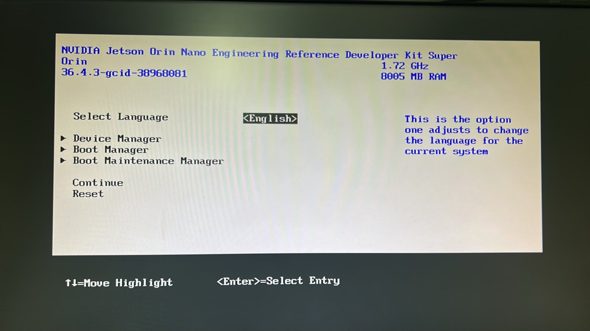

# 03 — Firmware y versión de JetPack

Este documento resuelve la trampa nº 1 de [`00_antes_de_empezar.md`](00_antes_de_empezar.md): el
firmware vive en la **QSPI del módulo**, no en la tarjeta, y tiene que ser compatible con la imagen
que se quiera arrancar. Acá se registra qué firmware traía *nuestra* placa, qué versión de JetPack
elegimos y por qué, y cuál de los caminos de actualización usamos.

> **Estado.** **Verificado en la placa el 30/07/2026.** El procedimiento y la decisión de versión
> se escribieron antes del primer arranque, a partir de la documentación oficial; la lectura del
> firmware de fábrica (`36.4.3`) es real y está registrada en §1 y §4. Lo único que sigue abierto
> son dos salidas de comando marcadas *(completar)* en §4.

## 1. Leer la versión de firmware de la placa

Es el primer dato que hay que tener, y el que nadie anota. Se lee **antes** de escribir nada.

> **La placa no tiene botón de encendido.** Arranca sola apenas se le enchufa la fuente al jack DC.
> El header J14 trae los pines para un botón (**1 y 2**), pero vienen sin poblar; y si se puentean
> los pines **7 y 8** se deshabilita el auto-encendido, que es lo único que haría falta un botón.
> De fábrica, **enchufar es encender**.
>
> Esto tiene una consecuencia práctica para el paso 2: no hay un botón que apretar y después
> empezar a contar. Hay que estar **ya tocando Esc** en el momento de enchufar la fuente.

1. Conectar monitor por DisplayPort, teclado USB y **nada en la ranura de la microSD**.
   La fuente de 19 V todavía **no**.

   > Sin tarjeta se aísla la variable: si la placa no da video igual, el problema es el adaptador
   > DisplayPort o la alimentación, no el firmware ni la microSD. Con la tarjeta puesta, una
   > pantalla negra tiene dos causas posibles y no se distinguen.

2. Con el dedo apoyado en **Esc**, enchufar la fuente al jack DC y **apretar Esc repetidamente**
   desde ese mismo instante. La ventana durante el logo de NVIDIA es corta.
   **El USB-C no alimenta la placa.**
3. Entra al menú UEFI. La versión de firmware aparece en la pantalla principal.
4. Anotarla textual acá abajo, y sacarle una foto: guardarla como
   [`imagenes/03_uefi.jpg`](imagenes/03_uefi.jpg).
5. Para apagar: `sudo poweroff` si llegó a arrancar un sistema, o desenchufar la fuente estando en
   el menú UEFI.

Sin monitor, lo mismo se lee por consola serie: cable USB-a-TTL al *button header*, RXD en el pin 3,
TXD en el pin 4 y GND en el pin 7.

**Firmware de fábrica de nuestra placa: `36.4.3`**, leído en el menú UEFI el **30/07/2026**.



*Pantalla del menú UEFI con la versión de firmware de fábrica.*

Es decir: la placa vino con firmware de **generación JetPack 6** (concretamente el de JetPack 6.2,
que es el release donde apareció el modo MAXN SUPER). **La trampa nº 1 no nos tocó.** No hay que
actualizar nada antes de instalar: cualquier imagen de JetPack 6.x arranca directo.

Cómo interpretarlo:

| Versión leída | Qué significa |
|---------------|---------------|
| **Anterior a 36.0** | Firmware de generación JetPack 5. **No puede arrancar una imagen de JetPack 6.x.** Es el caso de fábrica más común, y es la causa de la pantalla negra sin mensaje de error. |
| **36.x o superior** | Firmware de generación JetPack 6. Ya puede arrancar imágenes 6.x directamente. |

> Si la placa no da video, no asumir que está rota. Probar **sin la microSD puesta**, y confirmar
> que el adaptador DisplayPort → HDMI sea **activo**.

## 2. Qué versión de JetPack elegimos, y por qué

**Decisión (julio 2026): la línea JetPack 6.2.x, apuntando a 6.2.2.**

> **Cómo terminó.** La microSD quedó en 6.2.2, y el SSD —flasheado después con SDK Manager— quedó
> en **6.2.3 (L4T 36.5.2)**, que es la misma línea 6.2.x y es lo que corre hoy. La decisión de
> abajo no cambió; cambió el número de revisión disponible al momento de flashear.

| | JetPack 6.2.2 | JetPack 7.2 |
|---|---|---|
| Jetson Linux | 36.5 | 39.2 |
| Ubuntu / kernel | 22.04 / 5.15 | 24.04 / más nuevo |
| Modo MAXN SUPER | Sí (desde 6.2) | Sí |
| Ecosistema de tutoriales | Maduro: `jetson-inference`, `jetson-containers`, Jetson AI Lab | En migración |
| ¿Evita actualizar el firmware? | No | **Tampoco**: exige firmware de generación 36.x ya instalado |

El punto decisivo es el último. JetPack 7.2 ya alcanza a la familia Orin, pero **no ahorra ningún
paso**: igual hay que llevar la QSPI a la generación 36.x primero. Con eso descartado, gana 6.2.x
porque el material de aprendizaje — que es para lo que compramos la placa — está escrito para esa
línea.

Esta decisión tiene fecha. Si dentro de un año el ecosistema ya migró, la respuesta puede ser otra:
lo que no cambia es el razonamiento.

### Detalle práctico sobre 6.2.2

**NVIDIA no publica imagen de microSD de 6.2.2.** Se instala **6.2.1** y se sube a 6.2.2 con `apt`
una vez arrancada la placa. Eso es correcto y no contradice a §3.6 del documento 00: lo prohibido es
saltar de JetPack 5.x a 6.x por `apt`; moverse dentro de la misma versión mayor es la vía normal.

## 3. Los dos caminos para actualizar el firmware

> **En nuestro caso no hizo falta ninguno.** El firmware era `36.4.3`, o sea ya de generación 6.
> Quedan documentados porque son el caso más común en placas de fábrica más viejas, y porque el
> camino A es el que se terminó usando igual para instalar en el SSD NVMe — donde SDK Manager es
> obligatorio, y donde de paso subió el firmware a `36.5.2`
> ([`05_instalacion_en_ssd_nvme.md`](05_instalacion_en_ssd_nvme.md)).

### Camino A — SDK Manager

Requiere PC con Ubuntu x86_64 nativo, que en el laboratorio tenemos.

SDK Manager **escribe la QSPI y el sistema operativo en la misma operación**, y acepta la **microSD
como destino de almacenamiento**, no solo el NVMe. Es decir: un solo procedimiento resuelve el
firmware y la instalación, sin importar qué versión traía la placa de fábrica.

Ventaja adicional: es exactamente el mismo procedimiento que se va a repetir, cambiando un
desplegable, cuando se instale en el SSD NVMe. Se aprende una sola herramienta.

El paso a paso está en [`04_instalacion_en_microsd.md`](04_instalacion_en_microsd.md).

### Camino B — Puente por microSD con JetPack 5.1.3 (no lo usamos)

Queda documentado porque es el camino oficial **para quien no tiene una PC con Ubuntu**, y porque el
documento 00 lo menciona como opción principal.

1. Grabar la imagen específica de JetPack 5.1.3 que NVIDIA publica para esto
   (`JP513-orin-nano-sd-card-image`) con Balena Etcher.
2. Arrancar, completar la configuración de Ubuntu y **conectarse a Internet**.
3. Verificar que la actualización de bootloader quedó agendada:

   ```bash
   sudo systemctl status nv-l4t-bootloader-config
   ```

4. Reiniciar y dejar que corra la actualización de firmware.
5. Instalar el actualizador de QSPI y reiniciar de nuevo:

   ```bash
   sudo apt update
   sudo apt install nvidia-l4t-jetson-orin-nano-qspi-updater
   ```

6. Apagar, cambiar la microSD por la de la versión destino.

Son dos descargas grandes, tres reinicios y dos esperas a ciegas. Con SDK Manager es un paso.

## 4. Registro

- **Fecha:** 30/07/2026
- **Firmware de fábrica leído en UEFI:** `36.4.3` (= JetPack 6.2)
- **¿Hizo falta actualizar firmware?** **No.** Ya era generación 36.x.
- **Camino de instalación elegido:** grabado directo de la imagen de microSD con Balena Etcher.
  SDK Manager se usó después para la instalación en SSD NVMe (06/08/2026), y en esa misma
  operación el firmware pasó de `36.4.3` a `36.5.2`.
- Versión de JetPack instalada, verificada con `apt-cache policy nvidia-jetpack`: *(completar)*
- Salida de `cat /etc/nv_tegra_release`: *(completar)*

### Tabla de versiones, para no perderse

| JetPack | Jetson Linux (L4T) |
|---------|--------------------|
| 6.2 | 36.4.3 ← **el firmware de fábrica de nuestra placa** |
| 6.2.1 | 36.4.4 (es la última con **imagen de microSD publicada**) |
| 6.2.2 | 36.5 (se llega por `apt`, no hay imagen) — quedó así la microSD |
| 6.2.3 | 36.5.2 — lo que instaló SDK Manager en el SSD, y el firmware que corre hoy |

## Fuentes

- [Camino de actualización de JetPack 6.x — Guía del Orin Nano Developer Kit](https://docs.nvidia.com/jetson/orin-nano-devkit/user-guide/latest/update_firmware.html)
- [BSP Setup — Guía del Orin Nano Developer Kit](https://docs.nvidia.com/jetson/orin-nano-devkit/user-guide/latest/setup_bsp.html)
- [Descargas y notas de JetPack](https://developer.nvidia.com/embedded/jetpack/downloads)

## Con qué seguir

[`04_instalacion_en_microsd.md`](04_instalacion_en_microsd.md).
