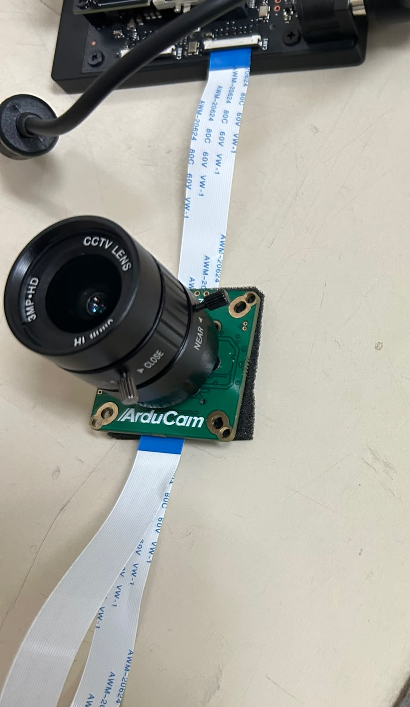

# 07 — Cámara CSI

Conectar la cámara al conector CSI, configurar el conector, verificar que el sensor aparece,
hacer la primera captura y la primera vista en vivo, transmitida por red hacia la PC.

> **Estado.** Verificado en la placa el **2026-08-11**: la cámara conecta, el sensor se detecta,
> la primera captura funcionó y la vista en vivo también, transmitida por la red hacia la PC.
> **Solo queda pendiente el control PTZ** (motor de pan/tilt/zoom), que es una capa aparte.

**Antes hay que haber hecho** [`06_puesta_a_punto.md`](06_puesta_a_punto.md).

## Lo que ya sabíamos antes de conectar

- **Conector de la Jetson**: 2 flex MIPI CSI de **22 posiciones**, paso 0,5mm, **contacto abajo**
  (§3.4 de [`00_antes_de_empezar.md`](00_antes_de_empezar.md#34-los-conectores-de-cámara-son-de-22-pines-no-de-15)).
- **Cámara del laboratorio**: **ArduCam UC-517** — PTZ (pan 360° / tilt 120° / zoom óptico 3x) con
  sensor **IMX477** (el mismo de la Raspberry Pi HQ Camera). Al ser IMX219/IMX477, JetPack trae
  driver de fábrica: se configura con `jetson-io.py`, sin compilar kernel.
- **Conector de la ArduCam**: también es de **22 posiciones** (comprobado a mano: un flex de 15
  pines no entra). Como la Jetson también es de 22, no hizo falta ningún adaptador — alcanzó con
  un cable **derecho de 22 a 22 pines**.
- Fuente puntual usada para confirmar que este modelo anda con el driver de fábrica: hilo del
  foro de NVIDIA Developer sobre esta misma ArduCam UC-517 (IMX477) en un Jetson Orin —
  <https://forums.developer.nvidia.com/t/arducam-imx477-uc-517-rev-d3-b0274-4-lane-configuation-on-cam1-of-orin-nx-16gb-development-kit/362367>.

## 1. Conectar la cámara físicamente

Con la placa **apagada y desenchufada** (mismo criterio que con el SSD y J14 — nunca tocar un
flex con la placa alimentada, el conector CSI no es *hot-plug*):

1. Levantar la traba del conector **CAM1** (el que se usó acá — confirmado mirando el silkscreen
   de la placa, no solo "el que estaba enchufado").
2. Insertar el cable de 22 a 22 pines, derecho y hasta el fondo, en los dos extremos (Jetson y
   ArduCam).
3. Cerrar las dos trabas.



*El cable derecho de 22 a 22 pines, conectado en CAM1. La orientación de los contactos es la que
importa: ver §3.1, donde justamente estaba al revés la primera vez.*

## 2. Configurar el conector (`jetson-io.py`)

```bash
sudo find / -iname "jetson-io.py" 2>/dev/null   # /opt/nvidia/jetson-io/jetson-io.py
sudo python3 /opt/nvidia/jetson-io/jetson-io.py
```

Es un menú de texto. El camino real fue:

```
Configure Jetson 22pin CSI Connector
  → Configure for compatible hardware
    → Camera IMX477-C          (la "C" corresponde a CAM1; "A" sería CAM0)
```

Al confirmar, pregunta si guardar los cambios y reiniciar — hay que aceptar el reinicio para que
tome el *device tree overlay* nuevo. Quedó anotado en `/boot/extlinux/extlinux.conf`:

```
MENU LABEL Custom Header Config: <CSI Camera IMX477-C>
OVERLAYS /boot/tegra234-p3767-camera-p3768-imx477-C.dtbo
```

## 3. Verificar que el sensor aparece

```bash
sudo apt install -y v4l-utils   # ya venía instalado en nuestro caso
v4l2-ctl --list-devices
ls /dev/video* /dev/media*
```

### 3.1 Primer intento: no apareció nada — diagnóstico

La primera vez, `/dev/video*` no existía. El diagnóstico fue por partes:

```bash
sudo dmesg | grep -iE "imx477|vi-output|tegra-camera|csi|camera"
```

```
imx477 9-001a: tegracam sensor driver:imx477_v2.0.6
imx477 9-001a: imx477_board_setup: error during i2c read probe (-121)
imx477: probe of 9-001a failed with error -121
```

El overlay se había cargado bien (el driver intentó bindear en el bus i2c-9, dirección `0x1a`,
que es la dirección estándar del IMX477) — el error `-121` es **"Remote I/O error"**: nadie
contestó por I2C. Confirmado con:

```bash
sudo i2cdetect -y -r 9
```

Fila `10:` sin nada en la columna `a` (debería aparecer `1a`). El sensor no estaba respondiendo.

**Causa real:** uno de los dos extremos del flex de 22 pines había quedado **insertado al
revés** (orientación de contactos invertida) — entraba físicamente porque coincide en cantidad
de pines, pero no hacía contacto eléctrico correcto. No fue un problema de driver ni de overlay.

### 3.2 Solución: reasentar el cable

Con la placa apagada y desenchufada otra vez: se abrió la traba, se sacó el flex, y se volvió a
insertar respetando la orientación correcta de los contactos en las dos puntas.

Después del reinicio, quedó así:

```bash
sudo i2cdetect -y -r 9
```

```
10: -- -- -- -- -- -- -- -- -- -- UU -- -- -- -- --
```

`UU` en la dirección `1a` significa que el **driver del kernel ya está usando ese dispositivo**
(por eso no se puede sondear directo) — confirma que esta vez sí respondió. Y en `dmesg`:

```
imx477 9-001a: tegracam sensor driver:imx477_v2.0.6
tegra-camrtc-capture-vi tegra-capture-vi: subdev imx477 9-001a bound
```

```bash
ls /dev/video* /dev/media*
```

```
/dev/media0  /dev/video0
```

## 4. Primera captura

**GStreamer** es un framework para armar "tuberías" (*pipelines*) de audio/video como una cadena
de piezas conectadas por `!`: una fuente, cero o más pasos de procesamiento, y un destino. El
comando `gst-launch-1.0` arma y corre una de esas tuberías directo desde la terminal, sin escribir
código. Es genérico — no es de NVIDIA ni de la Jetson — pero la Jetson aporta piezas propias para
usar su hardware.

**`nvarguscamerasrc`** es una de esas piezas: el "elemento fuente" que lee la cámara CSI a través
del **ISP** (*Image Signal Processor*), un bloque de hardware dedicado dentro del chip de la
Jetson que convierte los datos crudos del sensor (formato Bayer) en una imagen usable — hace el
demosaicing, auto-exposición, balance de blancos y reducción de ruido en hardware, sin gastar CPU.
Por debajo, `nvarguscamerasrc` habla con el ISP a través de **libargus**, la librería de cámara de
NVIDIA (la misma que usan `nvgstcapture-1.0` y otras herramientas de captura de la Jetson).

Como es un pipeline de terminal que en este caso escribe a un archivo (`filesink`), **no hace
falta ningún monitor ni servidor gráfico (X) en la Jetson** — corre perfecto por SSH. Solo haría
falta X si se agrega al final una pieza que dibuja en pantalla, como `nveglglessink` (ver
"vista en vivo" más abajo).

```bash
gst-launch-1.0 nvarguscamerasrc num-buffers=1 sensor-id=0 ! \
  'video/x-raw(memory:NVMM),width=3840,height=2160' ! nvjpegenc ! \
  filesink location=~/primera_captura.jpg
```

Argus reportó los modos de sensor disponibles para este IMX477:

```
3840 x 2160  FR = 29.999999 fps
1920 x 1080  FR = 59.999999 fps
```

La captura terminó con `Done Success` en ambos lados (`CONSUMER` y `GST_ARGUS`). El archivo se
trajo a la PC para verlo, desde una terminal nueva **en la PC** (no dentro de la sesión SSH):

```bash
scp indea@<ip_de_la_jetson>:~/primera_captura.jpg .
```

Confirmado: la imagen se abre bien y muestra lo que ve la cámara.

## 5. Vista en vivo, transmitida por red

Como la Jetson no tiene monitor conectado, "vista en vivo" acá significa **transmitir el video
por la red hacia la PC** y verlo ahí, en vez de dibujarlo en una pantalla local. Se arma con dos
pipelines de GStreamer: uno en la Jetson que codifica y manda, y uno en la PC que recibe y
muestra.

### 5.1 Primer obstáculo: no llegaba nada — pero no era la red

Antes de armar el pipeline completo, se probó la conectividad con **`nc`** (*netcat*, una
herramienta para mandar/recibir datos crudos por la red sin ningún protocolo de aplicación de
por medio — útil para probar si dos máquinas se pueden hablar en un puerto y protocolo dados
antes de meter algo más complejo):

```bash
# en la PC: queda escuchando
nc -u -l 5000
# en la Jetson: manda un mensaje de prueba
echo "hola desde la jetson" | nc -u -w1 <ip_de_la_PC> 5000
```

La primera vez no llegó nada, ni siquiera probando desde una segunda PC conectada por cable
Ethernet (mismo segmento de red que la Jetson) — eso ya descartaba el tema de WiFi vs. Ethernet
en subredes separadas (ver §0.1 de [`06_puesta_a_punto.md`](06_puesta_a_punto.md#01-reconectarse-sin-monitor-sin-buscar-la-ip-de-nuevo),
que sí aplica a mDNS pero no necesariamente a esto). La causa real era más simple: **el firewall
de la propia PC** (`ufw`) tiene la política por defecto "deny incoming" y solo dejaba pasar el
puerto usado por VNC. Se resolvió abriendo el puerto:

```bash
sudo ufw allow 5000/udp
```

Con eso, la prueba de `nc` llegó bien. Moraleja: el tráfico **unicast** (una IP hablándole directo
a otra) cruza sin problema entre WiFi y Ethernet en esta red — lo único que no cruza es el
**multicast** que usa mDNS (§0.1 de 06). No hay que confundir los dos problemas.

### 5.2 Segundo obstáculo: la Orin Nano no tiene codificador de video por hardware

El primer intento de pipeline usaba `nvv4l2h264enc` (el encoder H.264 acelerado por hardware que
trae la Jetson) y falló con `no element "nvv4l2h264enc"`. No es un paquete que faltó instalar:
**la Jetson Orin Nano no tiene el motor NVENC** (el bloque de silicio dedicado a codificar
video) — es una limitación real del chip, para abaratarlo frente a los modelos Orin NX/AGX, que
sí lo tienen. Sí tiene, en cambio, el decodificador (`nvv4l2decoder` — por eso aparece en
`gst-inspect-1.0`, y por eso se pudo usar sin problema para leer video ya codificado).

La alternativa que recomienda la documentación oficial de NVIDIA es codificar **por software**,
con la CPU, usando el elemento `x264enc`:
<https://docs.nvidia.com/jetson/archives/r36.2/DeveloperGuide/SD/Multimedia/SoftwareEncodeInOrinNano.html>.
Con el preset `ultrafast` y `tune=zerolatency` (para minimizar el retraso, pensado para
streaming en vivo y no para guardar un archivo) rinde bien en los 6 núcleos de la Orin Nano.

Dos paquetes de GStreamer faltaban y se instalaron sobre la marcha:

```bash
# en la Jetson: h264parse vive en el paquete "bad"
sudo apt install -y gstreamer1.0-plugins-bad

# en la PC: el decodificador avdec_h264 vive en el paquete "libav"
sudo apt install -y gstreamer1.0-libav
```

### 5.3 Pipelines finales que funcionaron

**En la Jetson** (emisor — captura, codifica por software y manda por UDP):

```bash
gst-launch-1.0 nvarguscamerasrc sensor-id=0 ! \
  'video/x-raw(memory:NVMM),width=1920,height=1080,format=NV12,framerate=30/1' ! \
  nvvidconv ! video/x-raw,format=I420 ! \
  x264enc speed-preset=ultrafast tune=zerolatency ! \
  h264parse ! rtph264pay config-interval=1 pt=96 ! \
  udpsink host=<ip_de_la_PC> port=5000
```

**En la PC** (receptor — arrancar primero, antes que el de la Jetson, para que quede esperando):

```bash
gst-launch-1.0 -v udpsrc port=5000 \
  caps="application/x-rtp, media=(string)video, encoding-name=(string)H264, payload=(int)96" ! \
  rtph264depay ! h264parse ! avdec_h264 ! videoconvert ! autovideosink
```

**RTP** es el protocolo que empaqueta el video codificado en paquetes de red pensados para tiempo
real (`rtph264pay` del lado que manda, `rtph264depay` del lado que recibe); va sobre **UDP** y no
TCP porque para video en vivo es preferible perder algún paquete y seguir, antes que frenar todo
esperando una retransmisión.

Con los dos pipelines corriendo, se abrió una ventana en la PC mostrando el video en vivo de la
cámara.

## Qué queda pendiente

- **Control PTZ** (motor de pan/tilt/zoom de la UC-517): es una capa aparte del driver de imagen
  estándar, probablemente necesite software propio de ArduCam. No investigado todavía.
- Reconectarse por SSH después de apagar y prender de nuevo puede requerir revisar la IP a mano
  otra vez — ver §0.1 de [`06_puesta_a_punto.md`](06_puesta_a_punto.md#01-reconectarse-sin-monitor-sin-buscar-la-ip-de-nuevo).

## Con qué seguir

[`08_primer_ejemplo_de_inferencia.md`](08_primer_ejemplo_de_inferencia.md): un primer ejemplo de
punta a punta, clasificando o detectando sobre el video de esta cámara — puede arrancar con
capturas fijas mientras la vista en vivo sigue pendiente.
