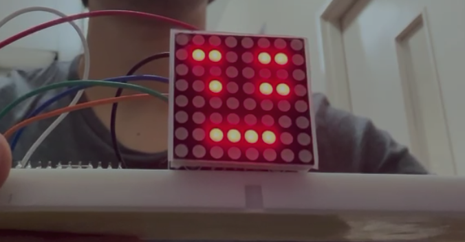

# Integración completa y refinamiento de gestos

Acá el proyecto deja de ser dos mitades que andan por separado y pasa a funcionar de punta a punta:
la Jetson ve la cara, decide qué gesto es, y la matriz LED de la Pico W lo dibuja en vivo. Cubre las
**Fases 6 y 7** de las siete que define el [`README.md`](README.md) del proyecto (sección 10).

Los dos lados por separado están documentados en [`lado_jetson.md`](lado_jetson.md) (visión por
computador) y [`lado_pico.md`](lado_pico.md) (WiFi, UDP y matriz). El código de esta etapa vive en
[`jetson/`](jetson/), separado de esta documentación.

> **Estado.** Verificado el **2026-08-31**: el sistema completo funcionando — webcam USB → MediaPipe
> → estados discretos (ojos, cejas, boca) → sprite de 8 bytes por UDP → matriz MAX7219. Queda
> pendiente afinar los umbrales de algunos gestos y fijar una IP reservada para la Pico.

---

## 1. De la cámara CSI a la webcam USB

El `README.md` del proyecto ya contemplaba las dos opciones desde el arranque ("cámara USB o CSI,
cualquiera de 720p sirve"), así que el cambio no toca la arquitectura. Y resultó **más simple**:

La cámara CSI necesitaba todo el rodeo de `nvarguscamerasrc`/GStreamer porque el sensor IMX477
entrega datos **crudos** (formato Bayer) que hay que pasar por el ISP de la Jetson para convertirlos
en una imagen usable — el problema que está documentado en
[`lado_jetson.md`](lado_jetson.md) secciones 4 y 5. Una webcam USB, en cambio, **procesa la imagen
adentro de su propio chip** y entrega frames listos por el protocolo estándar UVC. Eso significa que
OpenCV la abre de la forma más simple posible:

```python
cap = cv2.VideoCapture(0)   # sin pipeline de GStreamer, sin nvvidconv, sin NVMM
```

### Identificar cuál de los nodos es el bueno

Una webcam suele registrar **dos** dispositivos, y solo uno entrega video:

```bash
ls /dev/video*
# /dev/video0  /dev/video1
```

Como ya nos había pasado que "abrir" no significa "andar" (el frame verde de la CSI), conviene
confirmar leyendo un frame real y mirando su forma y brillo, no solo `isOpened()`:

```python
import cv2
for i in range(4):
    cap = cv2.VideoCapture(i)
    ok, frame = cap.read()
    if ok:
        print(f"Indice {i}: frame OK, shape={frame.shape}, brillo={frame.mean():.1f}")
    else:
        print(f"Indice {i}: no abrio o no leyo nada")
    cap.release()
```

Resultado real:

```
Indice 0: frame OK, shape=(1080, 1920, 3), brillo=36.3
Indice 1: no abrio o no leyo nada
```

Y en el log de OpenCV, para el índice 1: `Device '/dev/video1' is not a capture device` — confirma
que ese segundo nodo es auxiliar (metadatos), no video.

---

## 2. Fase 6 — que la Jetson mande el sprite de verdad

Hasta acá la Jetson calculaba el sprite y lo **imprimía en consola**; nunca lo mandaba a ningún
lado. Del lado de la Pico ya estaba todo listo (recibe 8 bytes por UDP y los dibuja, ver
[`lado_pico.md`](lado_pico.md) sección 9).

### Dividir el problema antes de escribir el script grande

Se hizo en dos pasos a propósito. Si se escribe todo junto (cámara + MediaPipe + EAR/MAR + UDP) y
algo falla, no se sabe si el problema es de **red** o de **lógica de visión**. Así que primero se
probó **solo el envío**, con un sprite fijo y sin tocar la cámara:

```python
import socket

IP_PICO = "192.168.1.100"
PORT = 5005

sprite = bytes([0x00, 0x24, 0x24, 0x00, 0x42, 0x24, 0x18, 0x00])  # la carita feliz

sock = socket.socket(socket.AF_INET, socket.SOCK_DGRAM)
sock.sendto(sprite, (IP_PICO, PORT))
```

Es el espejo exacto de la prueba que ya se había hecho desde la Pico con `nc`: mismo sprite, mismo
protocolo, pero ahora emitido desde la Jetson en Python. La matriz mostró la carita — camino de red
confirmado.

Recién con eso resuelto se conectó la lógica de visión que ya funcionaba, cambiando el paso final:
en vez de imprimir el sprite, se empaqueta en 8 bytes y se manda por ese mismo socket. La conversión
es directa, porque cada fila del sprite ya es una cadena de ocho `'0'`/`'1'`:

```python
def sprite_a_bytes(sprite):
    return bytes(int(fila, 2) for fila in sprite)
```

Interpretar `"00100100"` como número binario da exactamente el byte que espera la Pico (bit 7 =
píxel izquierdo).

### Trampa real: la matriz no cambiaba, y el diagnóstico inicial estaba equivocado

Al correr el script integrado, la matriz se quedó congelada mostrando la carita feliz del paso
anterior. La primera hipótesis fue que MediaPipe no estaba detectando ninguna cara con esta cámara
nueva — el razonamiento parecía sólido: ninguno de los sprites del script es esa carita feliz, así
que si nunca entraba al bloque de envío, la matriz seguiría mostrando el último sprite recibido.

Antes de tocar nada se agregó visibilidad: una versión del script con `print()` cada 15 frames
mostrando brillo y si había cara detectada. Los datos desmintieron la hipótesis:

```
frame 60  brillo=114.5  cara_detectada=True
  -> enviado, EAR=0.672 MAR=0.576
  -> enviado, EAR=0.683 MAR=0.363
```

Detectaba bien **y** mandaba paquetes con valores que cambiaban. La causa real la encontró el
usuario: **`main.py` no estaba corriendo del lado de la Pico** — no se había arrancado en Thonny. La
Jetson mandaba paquetes correctos a una placa que no los escuchaba, y la matriz conservaba lo último
que había recibido en la sesión anterior.

La lección: cuando el síntoma es "no cambia nada", el estado congelado puede ser de **cualquiera**
de los dos extremos. Los prints de diagnóstico sirvieron igual — descartaron la mitad equivocada.

---

## 3. Latencia y gestos que se perdían

Con todo conectado aparecieron dos síntomas:

- La boca se quedaba **"pegada"** abierta en la matriz cuando ya se había cerrado.
- Los **ojos cerrados casi nunca** se registraban.

Apuntan a causas distintas pero al mismo origen: cada vuelta del loop tardaba demasiado.

**El primero** es la firma de los **frames viejos acumulados en el buffer**. Si procesar un frame
tarda más que el intervalo con que la webcam entrega frames nuevos, OpenCV los va encolando — y cada
`read()` devuelve el más viejo de la cola, no el más reciente. El retraso crece solo, y uno termina
viendo su propia cara "en el pasado".

**El segundo** es de muestreo: un parpadeo dura ~100-300 ms. Si el loop procesa pocos frames por
segundo, es fácil que el parpadeo entero caiga **entre** dos frames procesados.

Dos correcciones, las dos en la configuración de la captura:

```python
cap.set(cv2.CAP_PROP_BUFFERSIZE, 1)      # que no acumule frames viejos
cap.set(cv2.CAP_PROP_FRAME_WIDTH, 640)   # la webcam venía en 1920x1080 por defecto:
cap.set(cv2.CAP_PROP_FRAME_HEIGHT, 480)  # mucho más pesado de lo necesario
```

Con eso la latencia pasó a ser aceptable en la práctica.

---

## 4. El visor de diagnóstico

Mirar números en consola no alcanza para saber si el estado detectado se corresponde con el gesto
real. Para eso está [`jetson/ver_camara_en_vivo.py`](jetson/ver_camara_en_vivo.py): transmite el
video con los landmarks dibujados y el estado de cada rasgo como texto encima.

Como la Jetson no tiene monitor, usa el mismo mecanismo de streaming ya documentado en
`07_camara_csi.md` de la guía de iniciación y en el tutorial `01_hello_ai_world.md`: RTP/UDP hacia
la PC, codificando por software con `x264enc` (la Orin Nano no tiene encoder por hardware).

En la Jetson, la salida se arma con un `VideoWriter` de OpenCV apuntando a un pipeline de GStreamer:

```python
pipeline_salida = (
    f"appsrc ! videoconvert ! x264enc speed-preset=ultrafast tune=zerolatency ! "
    f"rtph264pay config-interval=1 pt=96 ! udpsink host={IP_PC} port={PORT_VIDEO}"
)
out = cv2.VideoWriter(pipeline_salida, cv2.CAP_GSTREAMER, 0, 20, (640, 480), True)
```

Y en la PC, **arrancando primero**, el receptor de siempre:

```bash
gst-launch-1.0 -v udpsrc port=1234 \
  caps="application/x-rtp, media=(string)video, encoding-name=(string)H264, payload=(int)96" ! \
  rtph264depay ! h264parse ! avdec_h264 ! videoconvert ! autovideosink
```

(Si no llega nada, revisar el firewall de la PC: `sudo ufw allow 1234/udp` — la misma traba que ya
había aparecido con el streaming de la cámara CSI.)

**Advertencia:** dibujar sobre cada frame y codificar video suma bastante CPU, así que mientras el
visor corre todo se siente más lento. Es una herramienta de **ajuste**, no para dejar prendida junto
con el uso normal.

Lo importante que muestra en pantalla, además del estado de cada rasgo, son los **valores numéricos
crudos con su umbral al lado** — que es exactamente lo que hace falta mirar para ajustar los
umbrales de `gestos.py` sin probar a ciegas.

---

## 5. Fase 7 — cuantización a estados discretos

Hasta acá el sistema elegía entre **tres caritas completas** predefinidas (neutral, ojos cerrados,
boca abierta). Eso tenía un límite de fondo que apareció al intentar un guiño.

### Por qué no se detectaba un guiño

Dos razones acumuladas:

1. El código calculaba `ear_prom = (ear_izq + ear_der) / 2` — **promediaba los dos ojos** en un solo
   número. Cerrar un ojo solo baja el promedio a mitad de camino, muchas veces sin cruzar el umbral.
2. Aunque lo cruzara, no existía ninguna carita que representara "un ojo sí, el otro no". El estado
   directamente no estaba contemplado.

La solución no es mover un umbral: es **componer** el sprite combinando el estado de cada rasgo por
separado, en vez de elegir de una lista fija. Es lo que el `README.md` del proyecto ya pedía en su
sección 8 (paso 6, "composición del sprite"), y que hasta ahora se había simplificado.

### El reparto de las 8 filas

8×8 es diminuto y ahora hay que meter tres rasgos. El presupuesto vertical quedó así:

| Fila | Qué ocupa |
|---|---|
| 0 | Cejas, cuando están levantadas |
| 1 | Cejas, cuando están normales o fruncidas |
| 2 | Separador (sin él, unas cejas normales y unos ojos cerrados se pegan y se leen como una sola ceja gruesa) |
| 3 | Ojos |
| 4 | Separador |
| 5-7 | Boca |

Y cómo se distingue cada estado con tan pocos píxeles:

- **Cejas:** *levantadas* = fila de arriba; *normales* = fila de abajo; *fruncidas* = fila de abajo
  pero corridas hacia el centro, que es cómo se ve un ceño fruncido real.
- **Ojos:** *abierto* = **un punto**; *cerrado* = un guiño en forma de **">" o "<"** (tres puntos en
  las filas 1-2-3: dos exteriores arriba y abajo, uno interior al medio). Se dejó en dos estados a
  propósito: la versión con tres niveles (abierto / entrecerrado / cerrado) resultaba difícil de
  distinguir a este tamaño y no aportaba. Cuando un ojo cierra, la mitad de la ceja de ese mismo lado
  se apaga (deja de dibujarse), así se lee como que la ceja "se va" junto con el párpado en vez de
  quedar flotando arriba — ver el comentario de `construir_sprite()` en
  [`gestos.py`](jetson/gestos.py) para el detalle de filas/columnas y por qué el guiño no puede bajar
  a la fila 4 (se pega con la sonrisa).
- **Boca:** *neutra* = línea recta; *sonrisa* = comisuras arriba y centro abajo; *triste* = al revés;
  *abierta* = óvalo de tres filas.



### Las dos métricas nuevas

Los ojos y la boca abierta ya tenían su métrica (EAR y MAR). Faltaban las otras dos:

**Altura de cejas.** Distancia vertical entre la ceja (landmarks 105 y 334, de la tabla del README) y
el párpado (159 y 386), dividida por la distancia entre las esquinas externas de los ojos:

```python
def altura_cejas(lm):
    e = escala(lm)
    izq = (lm[159].y - lm[105].y) / e
    der = (lm[386].y - lm[334].y) / e
    return (izq + der) / 2
```

Esa división por `escala()` es la que hace que la medida **no dependa de qué tan lejos estés de la
cámara**: si te acercás, suben las dos distancias en la misma proporción y el cociente no cambia.

**Curvatura de boca.** Es el dato que el MAR solo no podía dar (lo que impedía distinguir sonrisa de
cara triste, algo que quedó explícitamente pendiente en `lado_jetson.md` sección 7). Compara la
altura de las comisuras contra el centro de los labios:

```python
def curvatura_boca(lm):
    y_centro = (lm[13].y + lm[14].y) / 2
    y_comisuras = (lm[61].y + lm[291].y) / 2
    return (y_centro - y_comisuras) / escala(lm)
```

Positivo = comisuras más arriba que el centro = sonrisa. Negativo = comisuras caídas = triste.

### Suavizado

Cada métrica pasa por una media móvil de 5 frames antes de decidir el estado. Es el paso 4 del
pipeline del README, y lo que evita que la carita tiemble entre dos estados cuando un valor queda
justo en el borde de un umbral.

---

## 6. La calibración: cuatro intentos hasta que anduvo

Esta parte se rehizo cuatro veces, y cada versión falló por un motivo distinto. Vale documentarlas
todas porque el error de cada una explica por qué la siguiente es como es.

**v1 — calibración inicial de 2 segundos.** Al arrancar, promediar la cara neutra y fijar los
umbrales a partir de eso. *Problema:* tediosa de hacer en cada corrida, y una vez se quedó colgada
bastante más de dos segundos — el reloj arrancaba al crear el objeto, así que si MediaPipe tardaba
en enganchar la cara, ese tiempo se consumía promediando nada.

**v2 — sin calibración, línea de base móvil.** Comparar contra el promedio de los últimos ~10
segundos, que converge solo al neutro de quien esté adelante. *Problema:* el sistema **se acostumbra**
a un gesto sostenido. Si mantenés las cejas levantadas diez segundos, la base se corre hacia arriba y
el gesto deja de detectarse. Peor: no hay forma de que el usuario entienda por qué dejó de andar.

**v3 — sin nada, umbrales absolutos fijos.** Todos los umbrales como constantes. *Problema:* los
números eran una **estimación mía, no medidos en la cara del usuario** — no tenía forma de saber su
valor real de altura de cejas. El resultado fue que marcaba "cejas levantadas" cuando no lo estaban.

**v4 — calibración inicial de 3 segundos, arreglada.** Se volvió a la idea de v1, corrigiendo lo que
la hacía molesta:

- El reloj arranca con el **primer frame en el que se detectó una cara**, no al crear el objeto.
- Además del tiempo, exige un **mínimo de muestras** (15): en una Jetson cargada el video puede ir a
  pocos FPS, y con 4 o 5 muestras un parpadeo justo en ese momento arruina la base de los ojos.
- Muestra **cuenta regresiva** en consola y barra de progreso en el visor, así se entiende qué está
  pasando.
- Mientras calibra **manda cara neutra a la matriz**, así se ve que el sistema está vivo.
- Al terminar **imprime los umbrales que salieron**, que es lo que hay que mirar si después algún
  gesto no dispara como se espera.

### La distinción que ordena todo

Hay dos cosas distintas que corregir, y confundirlas fue lo que hizo dar tantas vueltas:

- La división por `escala()` corrige la **distancia a la cámara**. Eso ya estaba resuelto en las
  métricas, y no necesita calibración de ninguna clase.
- La calibración corrige la **anatomía**: cejas naturalmente altas o bajas, ojos más o menos
  rasgados, comisuras un poco caídas en reposo. Eso no lo puede resolver ninguna fórmula — hay que
  medirlo en la cara que esté adelante.

Por eso los umbrales salen de la base de cada persona, pero de dos formas distintas según la métrica:
los **ojos van por fracción** (un ojo rasgado tiene un EAR neutro más bajo, y su umbral de cerrado
tiene que bajar en la misma proporción) y **cada ojo se calibra por separado**, porque casi ninguna
cara es simétrica. El resto va **por diferencia**: lo que importa no es el valor absoluto sino
cuánto te apartaste de tu propia cara neutra.

### Por qué la base queda fija

Una vez calibrada, la línea de base **no se vuelve a tocar** en toda la sesión. Es la diferencia
central con v2, y es a propósito: garantiza que la misma pose dé siempre el mismo estado, y que un
gesto sostenido se siga detectando todo el tiempo que dure.

---

## 7. Estructura del código

Tres archivos en [`jetson/`](jetson/):

| Archivo | Rol |
|---|---|
| [`gestos.py`](jetson/gestos.py) | Todo lo que va de "landmarks" a "sprite": métricas, calibración, umbrales, suavizado y composición |
| [`jetson_face.py`](jetson/jetson_face.py) | El programa real: captura, detecta y manda el sprite por UDP a la matriz |
| [`ver_camara_en_vivo.py`](jetson/ver_camara_en_vivo.py) | El visor de diagnóstico, con estados y valores dibujados sobre el video |

**Por qué existe `gestos.py` y no está todo en los dos scripts:** la lógica de umbrales y estados la
necesitan los dos. Duplicada, en dos sesiones habrían divergido, y el visor de diagnóstico habría
empezado a mostrar un estado distinto del que realmente se le manda a la matriz — es decir, la
herramienta que existe para confiar en lo que ves habría empezado a mentir sin avisar.

---

## 8. Complicaciones y cómo se resolvieron

| Problema | Causa | Solución |
|---|---|---|
| `pkill` no mataba los procesos y la cámara seguía ocupada | Los procesos estaban **suspendidos** (`Ctrl+Z` suspende, no cierra) — se ve en la columna `STAT` de `ps` como `T`. Un proceso suspendido no puede atender la señal de terminación | `pkill -9 -f jetson_face` (SIGKILL lo aplica el kernel, sin depender del proceso) |
| Después de reconectar la webcam, `Cannot identify device '/dev/video0'` | Se desconectó y reconectó la cámara mientras los procesos zombis todavía tenían tomados `video0` y `video1`, así que el sistema le asignó nodos nuevos (`video1` y `video2`) | Confirmar con `ls /dev/video*` y usar el índice nuevo. El mensaje distingue los dos casos: *"is busy"* = existe pero está ocupado; *"Cannot identify device"* = ya no existe |
| `ModuleNotFoundError: No module named 'mediapipe'` | Se corrió el script sin activar el venv | `source ~/espejo_facial_venv/bin/activate` antes de correr |
| `SyntaxError: invalid syntax` en la línea de la IP | Se escribió `IP_PC = 192.168.1.101` sin comillas; Python intenta leerlo como número y un número no puede tener tres puntos | Una IP es texto: `IP_PC = "192.168.1.101"` |
| Errores de bash al pegar el código (`import: command not found`, `syntax error near unexpected token`) | Se pegó código Python directo en la terminal | Guardarlo en un archivo (`cat > archivo.py << 'EOF' ... EOF`) y correrlo con `python3` |
| La cámara quedaba tomada cuando el script moría | El `cap.release()` estaba al final del script, y no se ejecutaba si el proceso terminaba por un error | Mover la liberación a un bloque `finally:`, más un chequeo de `isOpened()` al arrancar que explica cómo diagnosticar |

---

## 9. Segunda vuelta de refinamiento: guiño, sensibilidad y mirada (03/09)

Después de probar el sistema con la matriz real aparecieron tres ajustes más, ya sobre un sistema
que funcionaba de punta a punta.

**Guiño superpuesto con la sonrisa.** El guiño ">"/"<" se había dibujado primero en las filas 2-3-4.
En la matriz real, sonreír y guiñar un ojo al mismo tiempo se veía como una sola forma pegada: la
punta de abajo del guiño (fila 4) caía en las mismas columnas que las comisuras de la sonrisa (fila
5), y a ese tamaño el ojo se leía fusionado con la boca. Se subió el guiño a las filas 1-2-3 —
liberando la fila 1 para el ojo cerrado no cuesta nada porque esa mitad de la ceja ya se apaga
cuando el ojo cierra (ver sección 5) — y la fila 4 quedó de separador real entre ojos y boca.

**Sensibilidad de sonrisa/triste.** Cerca de la cara neutra, `curva` disparaba sonrisa o triste con
gestos mínimos. Se subió el margen (`DELTA_CURVA_SONRISA` / `DELTA_CURVA_TRISTE` en
[`gestos.py`](jetson/gestos.py)) de 0.015 a 0.025, para que haga falta un gesto más marcado.

**Seguimiento de mirada (iris).** Se probó agregar dirección de mirada usando los landmarks de iris
que trae el modelo (478 en vez de 468, ver "Las dos métricas nuevas" en la sección 5). La métrica se normaliza igual que
`altura_cejas()`: posición del iris como fracción entre las esquinas del propio ojo, para que no
dependa de a qué distancia o ángulo esté la cara — mismo principio que `escala()`.

- **Horizontal (izquierda/centro/derecha) funciona bien** y quedó activo: mover los ojos a los
  costados no cambia la apertura del párpado ni la altura de la ceja, así que no interfiere con el
  resto de los gestos. Con ambos ojos abiertos, el punto del ojo en la matriz se corre una columna
  hacia el lado que se está mirando.
- **Vertical (arriba/abajo) se probó y se sacó.** En la prueba real, mirar arriba o abajo disparaba
  guiños y cejas levantadas falsos: mover los ojos verticalmente mueve también el párpado y la ceja
  lo suficiente como para cruzar esos umbrales. No es un problema de calibración (un `DELTA` mal
  puesto) sino un confundido anatómico entre "mirada vertical" y las métricas que ya se usan para
  ojo cerrado y cejas — no tiene arreglo ajustando un número. Se descartó, con la explicación en el
  comentario junto a `DELTA_GAZE_X` en `gestos.py`.
- Como con el guiño, la mirada se ignora por completo mientras cualquier ojo esté cerrado: no tiene
  sentido mostrar hacia dónde miraba un ojo que ya no se ve.

---

## 10. El monitor propio de la Jetson: landmarks sin salir de `jetson_face.py` (09/09)

Hasta acá, ver los landmarks en vivo exigía [`ver_camara_en_vivo.py`](jetson/ver_camara_en_vivo.py)
(sección 4), con todo el rodeo de RTP/UDP hacia una PC — porque se asumía que la Jetson no tenía
monitor propio a mano. Con un monitor conectado directo a la placa, ese rodeo sobra: `cv2.imshow()`
puede abrir la ventana ahí mismo, sin codificar ni mandar nada por red.

Se llevó ese dibujo (landmarks + texto de estados + valores crudos con su umbral, la misma
`texto_con_borde()` que ya tenía el visor) directo a
[`jetson_face.py`](jetson/jetson_face.py). Ahora un solo proceso hace las dos cosas a la vez: manda
el sprite por UDP a la matriz **y** muestra la ventana con los landmarks, incluida la barra de
progreso durante los 3 segundos de calibración. `ver_camara_en_vivo.py` no se tocó — sigue
sirviendo para cuando la Jetson esté sin monitor a mano y haga falta ver el video desde la PC.

**Detalle no obvio:** `cv2.imshow()` necesita una sesión gráfica local (`DISPLAY` seteado). Una
sesión SSH normal da una terminal en la Jetson pero no acceso a su pantalla física — hay que
correr `jetson_face.py` desde una terminal abierta **en el propio escritorio de la Jetson**
(sentado ahí, con su teclado), no desde el SSH de la PC.

Y aun ahí falló, con `Can't initialize GTK backend`: esa terminal tenía `DISPLAY` vacío, y el
servidor gráfico de esta placa corre como **`:1`**, no el `:0` que suele ser el default (por eso
adivinar `:0` tampoco sirvió). El número real se averigua listando los sockets de X:

```bash
ls /tmp/.X11-unix/    # devuelve X1  ->  el display es :1
export DISPLAY=:1
```

---

## 11. La Jetson como punto de acceso WiFi, sin depender del router del laboratorio (09/09)

Pregunta que motivó esto: ¿se puede transmitir de la Jetson a la Pico por WiFi sin un router en el
medio? El chip WiFi de la Pico W (CYW43439) solo sabe ser **cliente** o **punto de acceso** en
MicroPython — no existe un modo ad-hoc/WiFi-Direct verdadero. La forma práctica de sacar el router
de en medio es al revés: convertir la propia **Jetson** en el punto de acceso, y que la Pico se
conecte a esa red como si fuera cualquier otra.

### Verificar antes de tocar nada: no perder el SSH

Convertir la placa WiFi de la Jetson en hotspot la desconecta de la red en la que estuviera antes
(`lab-raspi`). Si la sesión SSH desde la PC viajaba por esa misma WiFi, cortarla también corta el
acceso a la placa. Antes de crear el hotspot se confirmó que había una salida alternativa:

```bash
nmcli device status
```

```
DEVICE            TYPE      STATE                   CONNECTION
enP8p1s0          ethernet  connected               Wired connection 1
wlP1p1s0          wifi      connected               lab-raspi
```

Hay Ethernet conectado (`enP8p1s0`) además de la WiFi (`wlP1p1s0`). Pero eso solo no alcanza: había
que confirmar por cuál de las dos entraba la sesión SSH que ya estaba abierta:

```bash
ip -4 -br addr show
```

```
wlP1p1s0    UP    192.168.1.102/24
enP8p1s0    UP    192.168.23.181/24
```

La IP usada para el SSH (`192.168.23.181`) coincidió con la de Ethernet, no con la de WiFi —
confirmado que tocar `wlP1p1s0` no iba a cortar nada.

### Crear el hotspot

```bash
sudo nmcli device wifi hotspot ifname wlP1p1s0 ssid espejo-jetson password "mirador2026"
```

Esto desconecta `wlP1p1s0` de `lab-raspi` y la deja transmitiendo la red nueva `espejo-jetson`, con
la Jetson de punto de acceso.

### Por qué la IP queda en `10.42.0.1`

No es una casualidad de esta red ni algo derivado de `lab-raspi`: es la convención fija que usa
**NetworkManager** para cualquier conexión de tipo "compartida"/hotspot, sin importar la máquina o
la red — siempre arma la subred `10.42.0.0/24` y deja al host (acá, la Jetson) en el `.1`, con un
servidor DHCP propio repartiendo el resto del rango a quien se conecte. Viene de ese bloque privado
(`10.0.0.0/8`, RFC 1918) precisamente porque casi ningún router doméstico o de oficina usa ese rango
por defecto (suelen usar `192.168.x.x`), así que rara vez choca con la red de la que se viene.

### Mover la Pico a esta red

Del lado de la Pico alcanza con cambiar `SSID`/`PASSWORD` en `wifi_config.py` y resubirlo por
Thonny. Al arrancar, `main.py` imprime la IP que le asignó el DHCP de la Jetson (salió
`10.42.0.170`), y esa es la que va en `IP_PICO` de [`jetson_face.py`](jetson/jetson_face.py).

### Trampa real: la Pico no veía la red, por la banda de 5 GHz

Con el hotspot levantado y sano, la Pico se quedaba colgada en el `while not wlan.isconnected()` de
`main.py`: el chip inicializaba y aceptaba el `connect()`, pero nunca asociaba. La causa es que la
**Pico W es solo 2.4 GHz**, y al crear un hotspot tanto `nmcli` como el panel de Settings de Ubuntu
eligen banda y canal por su cuenta — si sale en 5 GHz, la Pico ni siquiera ve la red en un `scan()`.
Es también por lo que el hotspot armado antes desde Settings no había funcionado.

Se fuerza la banda una vez y queda guardada en el perfil de la conexión:

```bash
sudo nmcli connection modify Hotspot 802-11-wireless.band bg 802-11-wireless.channel 6
sudo nmcli connection up Hotspot
```

Para diagnosticarlo desde la Jetson: `iw dev wlP1p1s0 info` dice en qué frecuencia está (si empieza
con `5`, es esto), y `iw dev wlP1p1s0 station dump` lista los clientes asociados — vacío significa
que ninguno enganchó.

---

## 12. Reordenar los archivos en la Jetson, y otras trampas del día (09/09)

Hasta acá los scripts, el modelo `face_landmarker.task` y el venv estaban sueltos en `/home/indea`.
Se juntaron en `~/proyecto_gestos/` para tener todo el proyecto en un solo lugar. La mudanza rompió
dos cosas, las dos por rutas absolutas escritas de antemano:

| Problema | Causa | Solución |
|---|---|---|
| `ModuleNotFoundError: No module named 'mediapipe'`, con el venv activado y el prompt mostrando `(espejo_facial_venv)` | El script `activate` guarda la ruta del venv como **texto fijo** del momento en que se creó (`VIRTUAL_ENV=/home/indea/espejo_facial_venv`), así que después de mover la carpeta seguía agregando al `PATH` una ruta inexistente. `which python3` lo delata: devolvía `/usr/bin/python3`, el del sistema, en vez del python del venv | Corregir esa ruta dentro de `bin/activate` con `sed`. Los paquetes ya estaban en su lugar, no hizo falta reinstalar nada |
| `FileNotFoundError: Unable to open file at /home/indea/face_landmarker.task` | La constante `MODEL` de los scripts apuntaba a la ubicación vieja del modelo | Actualizar `MODEL` en `jetson_face.py`, `ver_camara_en_vivo.py` y `test_iris.py` |

Otras dos que aparecieron el mismo día, sin relación con la mudanza:

| Problema | Causa | Solución |
|---|---|---|
| El SSH a la Jetson empezó a dar `Connection timed out`, pero el `ping` respondía perfecto | La placa estaba saturada corriendo el script de visión, y `sshd` no conseguía turno para atender conexiones nuevas. El `ping` sigue andando porque lo responde el kernel, sin depender de que haya CPU libre | Cerrar los procesos que quedaron dando vueltas (`pkill -9 -f jetson_face`). El par "ping bien + puerto 22 en timeout" es la firma que distingue esto de un problema de red |
| En la Pico, `[CYW43] HT not ready` y `OSError: EPERM` al activar la WiFi | El chip inalámbrico quedó en mal estado y el reinicio suave de Thonny (`Ctrl+D`) no lo resetea | Ciclo de alimentación real: desenchufar el USB unos segundos y volver a enchufar |

---

## 13. Próximos pasos

1. **Ajustar los umbrales de los gestos que cuesten** — los `DELTA_*` de
   [`gestos.py`](jetson/gestos.py) están juntos arriba del archivo, comentados. El método:
   correr el visor (o ahora, directamente `jetson_face.py` con monitor propio), hacer el gesto que
   no dispara, y mirar en pantalla el valor crudo con su umbral al lado.
2. **Probar la calibración con más de una persona** — es justamente lo que debería resolver, pero
   hasta ahora solo se verificó con una cara.
3. **Dejar fija la IP de la Pico.** Ya no depende del router del laboratorio (sección 11), pero la
   sigue asignando por DHCP el hotspot de la Jetson: si cambia, hay que volver a editar `IP_PICO`.
   La ventaja ahora es que el servidor DHCP es la propia placa, así que la reserva se puede
   configurar sin depender de hardware ajeno.
4. **El video de 30 segundos** que el `README.md` pide como entregable (sección 13), ahora que el
   sistema completo funciona.
5. **Mirada vertical**, si se retoma alguna vez: haría falta una métrica que no dependa de la
   apertura del párpado (la sección 9 explica por qué la actual no sirve) — por ejemplo, mirar solo
   qué tan cerca está el iris del borde del párpado ya cerrado en vez de su reflejo/posición
   absoluta, o descartar el frame si el EAR/altura de ceja se movieron junto con el iris.
