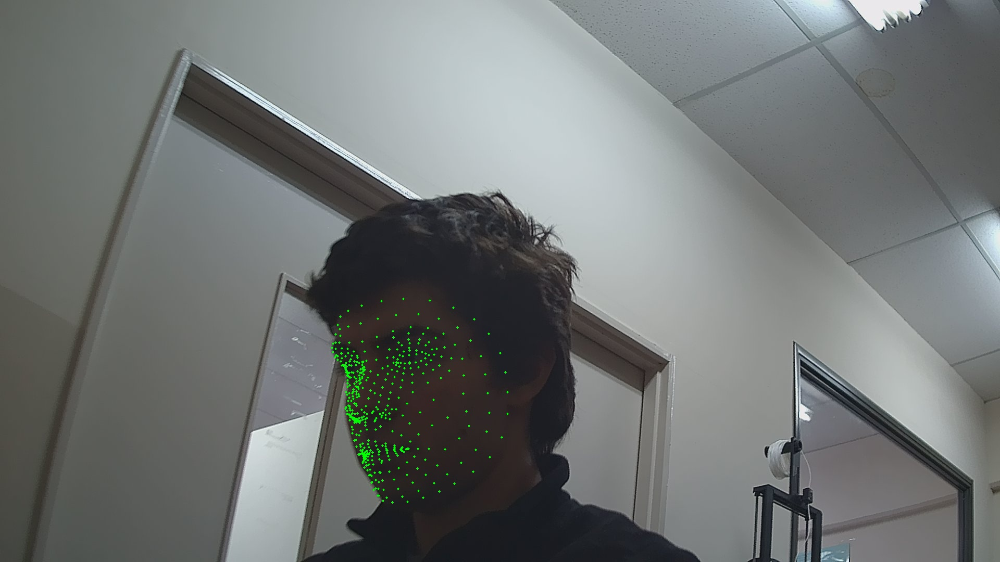
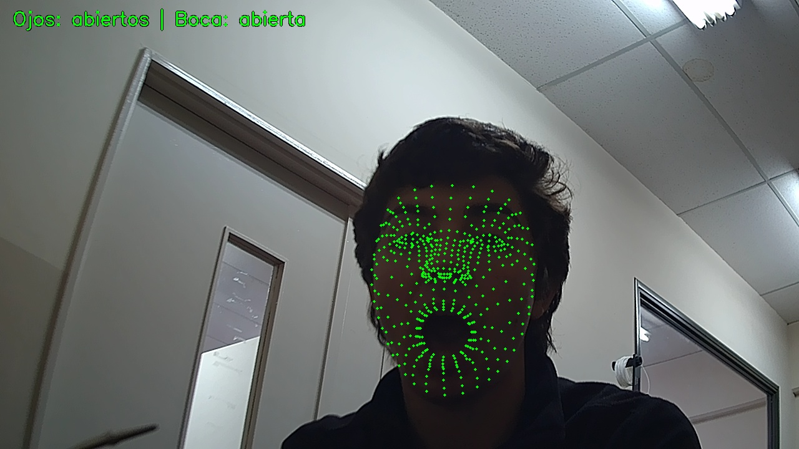

# Lado Jetson — visión por computador

Todo lo hecho hasta ahora del lado "cerebro" del proyecto: detectar la cara con la cámara CSI,
calcular sus gestos y convertirlos en un sprite. El lado Pico W (matriz LED) todavía no arrancó —
ver "Próximos pasos" al final.

> **Estado.** Verificado en la placa el **2026-08-21**: Fases 0, 3, 4 y 5 de las siete que define
> el [`README.md`](README.md) del proyecto (sección 10). Fases 1 y 2 (Pico W) sin empezar — no
> llegó todavía la matriz LED.

**Antes hay que haber hecho:** la puesta a punto de la placa (Docker con runtime `nvidia`) y la
cámara CSI conectada y funcionando — documentado en
[`06_puesta_a_punto.md`](../../guia_de_iniciacion/06_puesta_a_punto.md) y
[`07_camara_csi.md`](../../guia_de_iniciacion/07_camara_csi.md) de la guía de iniciación.

---

## 1. Qué se hizo

Se armó el entorno de Python en la Jetson, se logró que **MediaPipe** encontrara la cara de una
persona en un frame real de la ArduCam, se calcularon en vivo dos métricas de gestos (apertura de
ojos y de boca) que reaccionan a parpadeos y a abrir la boca, y se generó — también en vivo — un
sprite de 8×8 impreso como ASCII art según el estado detectado. Todo el camino tuvo trampas reales
de entorno (versión de una API, soporte de GStreamer, choques de dependencias) que se documentan
abajo con su solución real.

---

## 2. Conceptos

### Qué es MediaPipe

Un framework de Google con modelos de visión por computador **ya entrenados** (cara, manos, pose),
livianos, pensados para correr rápido incluso sin GPU dedicada. Acá se usa el modelo **Face
Landmarker**: le das un frame y devuelve puntos (*landmarks*) 3D normalizados ubicados sobre la
cara — contorno de ojos, cejas, labios, iris, etc. No hace falta entrenar nada; el modelo viene
resuelto, solo hay que darle la imagen.

### Qué es OpenCV

La librería que se ocupa de **leer la cámara y entregar cada frame** como una matriz de píxeles
que Python puede manipular. La división de trabajo con MediaPipe es clara: OpenCV abre la cámara y
entrega la imagen cruda; MediaPipe la procesa y busca la cara. Uno no reemplaza al otro.

### Por qué un entorno virtual de Python (y no instalación global)

Un **venv** es una carpeta aislada con su propia copia de paquetes de Python, separada de lo que
usa el resto del sistema. Se prefirió sobre instalar global porque JetPack corre sobre Ubuntu
22.04, donde varias herramientas del sistema (como `jtop`) dependen de paquetes Python instalados
por `apt` — mezclar versiones ahí puede romper algo que no tiene nada que ver con este proyecto.
Es un aislamiento más liviano que Docker: un venv solo separa paquetes de Python, mientras que
Docker aísla un sistema operativo completo (por eso pesaba ~7 GB cuando se usó para
`jetson-inference`, que necesitaba versiones exactas de TensorRT). Para MediaPipe, que son solo
paquetes de Python sin relación con CUDA, el venv alcanza.

---

## 3. Fase 0 — Preparar el entorno

Decisión: venv en vez de instalación global, por lo explicado arriba.

**Trampa real:** crear el venv falló la primera vez:

```
The virtual environment was not created successfully because ensurepip is not
available. On Debian/Ubuntu systems, you need to install the python3-venv
package using the following command.

    apt install python3.10-venv
```

Ubuntu separó esa pieza del módulo `venv` en un paquete aparte. Se resolvió instalándola una sola
vez (es la única vez que hace falta `sudo` en todo este proceso):

```bash
sudo apt install python3.10-venv
python3 -m venv ~/espejo_facial_venv
source ~/espejo_facial_venv/bin/activate
pip install mediapipe opencv-python
python3 -c "import mediapipe as mp; import cv2; print('MediaPipe:', mp.__version__); print('OpenCV:', cv2.__version__)"
```

Resultado real: `MediaPipe: 1.0.1`, `OpenCV: 5.0.0` — el entorno quedó funcionando (aunque este
primer OpenCV, el de `pip`, resultó tener una limitación que aparece más abajo).

---

## 4. Fase 3 — Detectar landmarks en un frame real

### Trampa: la API de MediaPipe cambió de versión

El primer script, escrito con la API "clásica" (`mp.solutions.face_mesh`, la que aparece en la
mayoría de los tutoriales en internet), falló:

```
AttributeError: module 'mediapipe' has no attribute 'solutions'
```

En la versión instalada (**1.0.1**) esa API fue eliminada por completo — no existe ni
`mediapipe.python`. Ahora todo pasa por la API nueva, **Tasks**, que además requiere descargar el
modelo aparte (antes venía empaquetado):

```bash
wget -O ~/face_landmarker.task https://storage.googleapis.com/mediapipe-models/face_landmarker/face_landmarker/float16/latest/face_landmarker.task
```

(3.6 MB, descarga confirmada — no un archivo de error).

### Trampa: la cámara "funcionaba" pero entregaba un frame vacío

Un primer intento de leer la cámara directo con `cv2.VideoCapture(0)` (V4L2 simple, sin GStreamer)
**parecía** funcionar: `Abrió: True`, frame de `(2160, 3840, 3)`. Pero al usarlo, la imagen
resultante era un rectángulo verde liso — la firma de un buffer vacío interpretado como color. El
sensor IMX477 entrega datos crudos (formato Bayer, sin procesar); necesitan pasar por el **ISP** de
la Jetson para convertirse en una imagen real, y a eso solo se llega vía `nvarguscamerasrc`
(GStreamer), no por V4L2 directo — tal como ya estaba documentado en `07_camara_csi.md`.

**Solución para esta prueba puntual:** capturar con el pipeline de GStreamer ya validado en la
guía de la cámara, guardando a un archivo, y leer ese archivo con MediaPipe (sin que OpenCV toque
la cámara todavía):

```bash
gst-launch-1.0 nvarguscamerasrc num-buffers=90 sensor-id=0 ! \
  'video/x-raw(memory:NVMM),width=1920,height=1080,framerate=30/1' ! nvjpegenc ! \
  multifilesink location=/home/indea/captura_%02d.jpg
```

(90 frames para que la auto-exposición se acomode; se usa el último, `captura_89.jpg`.)

```python
frame = cv2.imread('/home/indea/captura_89.jpg')
# ... FaceLandmarker con la API Tasks, detector.detect(mp_image) ...
```

**Resultado real:** `Cara detectada: 478 landmarks` (los 468 clásicos + 10 del iris, que la API
nueva incluye siempre) sobre una imagen con brillo promedio 115 (bien expuesta).



---

## 5. Habilitar video en vivo (OpenCV + GStreamer)

Para no depender de sacar una foto con GStreamer y leerla de un archivo, se buscó que **OpenCV**
lea la cámara en vivo directamente. Apareció una cadena de tres problemas encadenados:

**Problema 1:** el `opencv-python` instalado por `pip` no tiene soporte de GStreamer:

```bash
python3 -c "import cv2; print(cv2.getBuildInformation())" | grep -i gstreamer
    GStreamer:                   NO
```

Sin eso, no puede abrir el pipeline `nvarguscamerasrc`. **Solución:** instalar el OpenCV del
**sistema** (compilado por Ubuntu contra las librerías de GStreamer), y recrear el venv con
`--system-site-packages` para que lo vea sin perder el aislamiento de MediaPipe:

```bash
sudo apt install python3-opencv
rm -rf ~/espejo_facial_venv
python3 -m venv --system-site-packages ~/espejo_facial_venv
source ~/espejo_facial_venv/bin/activate
pip install mediapipe
```

**Problema 2:** `pip install mediapipe` trae `opencv-contrib-python` (sin GStreamer) como
dependencia automática y lo instala *dentro* del venv — eso vuelve a tapar al OpenCV del sistema,
porque lo instalado en el venv siempre gana sobre lo heredado por `--system-site-packages`.
**Solución:** desinstalarlo después de instalar MediaPipe:

```bash
pip uninstall -y opencv-contrib-python opencv-python
```

**Problema 3:** con eso resuelto, importar `mediapipe` rompía al importar `matplotlib`
internamente:

```
A module that was compiled using NumPy 1.x cannot be run in NumPy 2.2.6...
ImportError: numpy.core.multiarray failed to import
```

`matplotlib` (del sistema) está compilado contra `numpy` 1.x, pero MediaPipe había traído
`numpy` 2.2.6 dentro del venv. **Solución:** fijar la versión vieja:

```bash
pip install "numpy<2"
```

**Verificación final**, la que hay que confiar de acá en adelante:

```bash
python3 -c "
import cv2, mediapipe as mp
print('OpenCV:', cv2.__version__, '| desde:', cv2.__file__)
print([l.strip() for l in cv2.getBuildInformation().split(chr(10)) if 'GStreamer' in l])
print('MediaPipe:', mp.__version__)
"
# OpenCV: 4.5.4 | desde: /usr/lib/python3/dist-packages/cv2.cpython-310-aarch64-linux-gnu.so
# ['GStreamer:                   YES (1.19.90)']
# MediaPipe: 1.0.1
```

Lo importante: `cv2.__file__` apunta al del **sistema**, con GStreamer activo.

Pipeline de GStreamer usado desde OpenCV para leer la cámara en vivo:

```python
PIPELINE = (
    "nvarguscamerasrc sensor-id=0 ! "
    "video/x-raw(memory:NVMM),width=1280,height=720,framerate=30/1 ! "
    "nvvidconv ! video/x-raw,format=BGRx ! videoconvert ! video/x-raw,format=BGR ! appsink"
)
cap = cv2.VideoCapture(PIPELINE, cv2.CAP_GSTREAMER)
```

---

## 6. Fase 4 — EAR y MAR en vivo

**EAR (Eye Aspect Ratio):** distancia vertical del ojo dividido por su distancia horizontal. Con el
ojo abierto da un valor más alto; al parpadear cae en picada porque el párpado tapa la distancia
vertical. **MAR (Mouth Aspect Ratio):** lo mismo para la boca — sube cuando se abre.

Se calculan con los landmarks de la tabla del README (sección 8): ojo izquierdo `33,133,159,145`,
ojo derecho `362,263,386,374`, boca `13,14,61,291`.

Con la cámara en vivo (`running_mode=VIDEO`, `detect_for_video`), corriendo 10 segundos con
parpadeos y apertura de boca reales, esto fue lo que imprimió la consola (extracto):

```
t= 2051ms  EAR_izq=0.023  EAR_der=0.077  MAR=0.018     <- parpadeo
t= 2516ms  EAR_izq=0.032  EAR_der=0.071  MAR=0.025     <- parpadeo
t= 4147ms  EAR_izq=0.546  EAR_der=0.555  MAR=0.094
t= 4370ms  EAR_izq=0.559  EAR_der=0.556  MAR=1.688     <- boca abierta
t= 4579ms  EAR_izq=0.523  EAR_der=0.524  MAR=1.754     <- boca abierta
t= 5741ms  EAR_izq=0.627  EAR_der=0.632  MAR=1.835     <- boca abierta
```

Confirma que las dos métricas reaccionan a los gestos reales, en vivo y sin retardo perceptible.

---

## 7. Fase 5 — De estados a sprite 8×8

Se cuantizaron los valores continuos a estados discretos, con umbrales **provisorios** (sacados de
los propios datos de arriba, no un valor universal — el README ya marca la calibración por persona
como riesgo conocido en su sección 11):

- Ojos: `EAR < 0.15` → cerrados, si no → abiertos.
- Boca: `MAR > 0.3` → abierta, si no → cerrada.

**Aclaración honesta:** el README describe 4 formas de boca (neutra/sonrisa/abierta/triste), pero
el MAR por sí solo **solo distingue abierta de cerrada** — no puede saber si es sonrisa o cara
triste, porque eso depende de si las comisuras están más arriba o más abajo que el centro de la
boca, un dato que el MAR no captura. Queda para la Fase 7 (refinamiento), agregando esa comparación
de alturas.

Cada estado selecciona uno de tres sprites 8×8 hardcodeados (neutral, ojos cerrados, boca abierta),
impresos como ASCII art en la consola — confirmado funcionando en vivo, cambiando de forma en
tiempo real según el gesto:

```
--- t=3033ms EAR=0.463 MAR=0.356 | boca abierta ---
. . . . . . . .
. ##. . ##.
. ##. . ##.
. . . . . . . .
. . . ##. . .
. . #. . #. .
. . #. . #. .
. . . ##. . .
```

Además se probó lo mismo sobre fotos fijas etiquetadas (5 capturas con pausa entre cada una,
dibujando el texto del estado sobre la imagen):



---

## 8. Complicaciones y cómo se resolvieron

| Problema | Causa | Solución |
|---|---|---|
| `ensurepip is not available` al crear el venv | Ubuntu separó esa pieza en el paquete `python3.10-venv` | `sudo apt install python3.10-venv` |
| `pip install` sin venv activo cayó en instalación de usuario | El venv no estaba activado (`source .../activate` faltó) antes de instalar | Desinstalar lo instalado por error, activar el venv, reinstalar adentro |
| `mp.solutions` no existe | MediaPipe 1.0.1 eliminó la API "clásica" a favor de la API "Tasks" | Usar `mediapipe.tasks.python.vision.FaceLandmarker` + descargar el modelo `.task` |
| Imagen completamente verde con `cv2.VideoCapture(0)` | El sensor IMX477 entrega datos Bayer crudos; V4L2 simple no pasa por el ISP | Capturar con `nvarguscamerasrc` (GStreamer) en vez de V4L2 directo |
| `GStreamer: NO` en el OpenCV de `pip` | Los wheels de `opencv-python` en PyPI no incluyen soporte de GStreamer | Instalar `python3-opencv` del sistema + venv con `--system-site-packages` |
| El OpenCV del sistema seguía tapado dentro del venv | `pip install mediapipe` trae `opencv-contrib-python` como dependencia, instalado en el venv | `pip uninstall -y opencv-contrib-python opencv-python` después de instalar mediapipe |
| `ImportError: numpy.core.multiarray failed to import` | `numpy` 2.x (traído por mediapipe) incompatible con `matplotlib` del sistema, compilado contra numpy 1.x | `pip install "numpy<2"` dentro del venv |
| Primer frame de la cámara detectaba "sin cara" | La cámara todavía no había acomodado exposición/enfoque en el instante exacto de la captura | Descartar unos frames de "calentamiento" antes de capturar el real |

---

## 9. Próximos pasos

1. **Fase 1-2 del lado Pico W, con LEDs sueltos como validación intermedia** (todavía no llegó la
   matriz MAX7219): confirmar si la Pico W ya tiene MicroPython cargado o hay que flashearlo, y
   definir la herramienta de desarrollo (se sugirió Thonny; PlatformIO es una alternativa más
   pensada para C/C++ que para MicroPython).
2. **Calibración real de los umbrales EAR/MAR**, idealmente probando con más de una persona — los
   valores de arriba son válidos para esta sesión puntual, no un estándar.
3. **Distinguir sonrisa de cara triste**, agregando el landmark de las comisuras de la boca
   relativo al centro (hoy el MAR sólo distingue abierta/cerrada).
4. **Cuando llegue la matriz LED:** Fase 6 del README — protocolo UDP de 8 bytes (uno por fila de
   la matriz) entre la Jetson y la Pico W.
