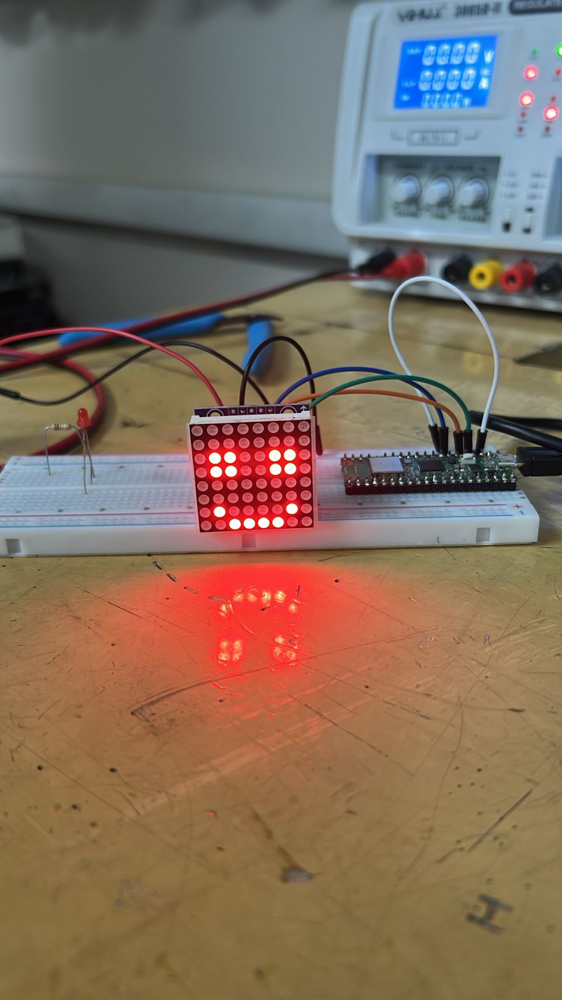

# Lado Pico W — WiFi, LED y matriz MAX7219

Primeros pasos del lado "cara" del proyecto: confirmar que la Pico W ya tiene MicroPython,
prender un LED, validar el camino completo por WiFi entre la Jetson y la Pico usando el LED de a
bordo como reemplazo provisorio de la matriz MAX7219, y — ya con la matriz real en mano — cablearla,
instalar su driver y dibujar en ella. El lado Jetson (MediaPipe, sprites) está documentado en
[`lado_jetson.md`](lado_jetson.md). El código de esta parte vive en [`pico/`](pico/), no en este
`.md` — acá se documenta el procedimiento, no el código en sí.

> **Estado.** Fase 1 simplificada (LED) y Fase 2 verificadas el **2026-08-25** — la Pico se conecta
> por WiFi, abre un socket UDP y prende/apaga el LED al recibir un paquete desde la Jetson. La
> matriz MAX7219 real llegó y se verificó el **2026-08-27**: cableada, con su driver instalado y
> corregido (rotación), dibujando sprites propios de punta a punta. El **2026-08-28** se unieron
> las dos partes del lado Pico: `main.py` ahora decodifica el sprite de 8 bytes recibido por UDP y
> lo dibuja en la matriz real — probado de forma aislada (sin la Jetson todavía) mandando la carita
> feliz a mano por `nc`, funcionó. El **2026-08-31** se cerró la Fase 6 completa: la Jetson ya manda
> el sprite que calcula en vivo y la matriz lo dibuja — ver [`integracion.md`](integracion.md).
> Sigue pendiente definir una IP fija para la Pico.

**Herramienta usada:** [Thonny](https://thonny.org/), con la Pico W ya conectada por USB y
detectada como intérprete **"MicroPython (Raspberry Pi Pico)"**.

---

## 1. Confirmar que la Pico ya tenía MicroPython

La Pico W del laboratorio ya venía con firmware cargado — no hizo falta flashear nada. Conectada
por USB (sin tocar el botón **BOOTSEL**: eso solo hace falta para *grabar* un firmware nuevo, no
para uso normal), el Shell de Thonny mostró directo:

```
MicroPython v1.28.0 on 2026-04-06; Raspberry Pi Pico W with RP2040
Type "help()" for more information.
>>>
```

---

## 2. Fase 1 simplificada — prender el LED de a bordo

Sin matriz LED todavía, se usó el LED integrado de la placa como primera prueba:

```python
from machine import Pin
import time

try:
    led = Pin("LED", Pin.OUT)   # Pico W: el LED está en el chip WiFi (CYW43), no en un GPIO común
except TypeError:
    led = Pin(25, Pin.OUT)      # Pico normal (sin W): GPIO25 directo

while True:
    led.toggle()
    time.sleep(0.5)
```

**Trampa real: pegar un `while True` en el Shell interactivo lo bloquea.** Corrido línea por línea
en el `>>>`, el LED tostaba bien, pero el Shell quedaba congelado en el loop infinito y no
aceptaba más comandos. Se resuelve con **Ctrl+C** para cortar, y de ahí en adelante todo el código
se escribió en el **editor** de Thonny (pestaña de arriba) y se corrió con **F5** — así se puede
iterar sin perder el Shell.

---

## 3. Trampa real: Thonny se desconectó y pareció un problema de firmware

Al desconectar la Pico un momento, `%Run` (F5) siguió "andando" pero tirando:

```
ModuleNotFoundError: No module named 'network'
```

Esto llevó a sospechar, en un primer momento, que el firmware instalado no era el build específico
de la **W** (el único que trae el driver WiFi CYW43 y el módulo `network`). El diagnóstico real fue
con:

```python
help('modules')
```

La lista que salió (`numpy`, `matplotlib`, `PyQt5`, `gnuradio`, `apt`, `dbus`, ...) es del **Python
de escritorio de la PC**, no de MicroPython — confirmó que Thonny, al perder la Pico, había caído
sola al intérprete local de la computadora sin avisarlo con claridad (el indicador está abajo a la
derecha, mostraba `<no backend>`). No era un problema de firmware.

**Solución:** reconectar la Pico por USB (sin BOOTSEL — normal, no modo bootloader) y volver a
elegir manualmente el intérprete **"MicroPython (Raspberry Pi Pico)"** con el puerto correcto en
`Ejecutar → Configurar intérprete`. Para confirmar el puerto desde la terminal de la PC, si hace
falta:

```bash
lsusb | grep -i "2e8a"      # 2e8a = vendor ID de Raspberry Pi
ls /dev/ttyACM*
```

En esta sesión, el dispositivo apareció como `Bus 003 Device 017: ID 2e8a:0005 MicroPython Board
in FS mode` y el puerto fue `/dev/ttyACM0`.

---

## 4. Fase 2 — Conectar la Pico por WiFi

### Trampa real: eduroam no es una opción para la Pico W

El laboratorio usa **eduroam**, que es WPA2-**Enterprise** (802.1X, con EAP — en este caso
Tunneled TLS + MSCHAPv2, usuario y contraseña institucionales en vez de una clave compartida). El
driver WiFi de MicroPython para el chip CYW43439 de la Pico W solo implementa **WPA/WPA2-Personal**
(PSK): no hace la negociación EAP que pide eduroam. No es una limitación de configuración, es que
el módulo `network` de MicroPython no tiene ese protocolo implementado. Se descartó eduroam de
entrada para este dispositivo.

Se evaluó como alternativa usar el hotspot del celular (WPA2-Personal estándar, sin este
problema), pero terminó sin hacer falta: apareció una red abierta del laboratorio.

### Trampa real: parecía que no conectaba a la red del laboratorio (`lab-raspi`)

Con la red **`lab-raspi`** (un router viejo del laboratorio) el primer intento se quedó
imprimiendo puntos sin parar, sin timeout. Antes de reintentar a ciegas, se armó un script de
diagnóstico que escanea las redes visibles y reporta el tipo de seguridad de cada una, y que
además reemplaza el loop infinito por uno con **timeout** y reporte del código de estado real:

```python
import network
import time

ssid = "lab-raspi"
password = "raspi-indea"

wlan = network.WLAN(network.STA_IF)
wlan.active(True)

for red in wlan.scan():
    print(red[0].decode(), "canal", red[2], "seguridad", red[4])

wlan.connect(ssid, password)

t0 = time.time()
while not wlan.isconnected() and time.time() - t0 < 15:
    print("status:", wlan.status())
    time.sleep(1)

if wlan.isconnected():
    print("Conectado. IP:", wlan.ifconfig()[0])
else:
    print("No conectó. Status final:", wlan.status())
```

La sospecha inicial era un bug conocido del CYW43 con routers viejos configurados en modo
WPA/WPA2 **mixto con TKIP** (que se queda "conectando" para siempre sin fallar nunca). El `scan()`
mostró `lab-raspi` con seguridad tipo `5`, junto con `eduroam` y otras redes cifradas también en
`5`/`7`, y las abiertas (`Red-UTN`, `BugNET`, `GittoNet`) en `0`. En la corrida con timeout,
conectó igual en unos segundos (`status: 1` dos veces, `status: 2` tres veces, y listo) — **fue
una falsa alarma**, probablemente solo necesitaba un poco más de tiempo que la primera vez, no un
problema real de compatibilidad.

**Resultado real:** la Pico quedó en la red `192.168.1.0/24` (router viejo, sin reserva DHCP —
la IP cambió entre reconexiones: `192.168.1.101` en la primera prueba, `192.168.1.103` en la
siguiente). Pendiente fijar una IP reservada si esto sigue pasando cuando se integre con la
Jetson de forma permanente.

---

## 5. Servidor UDP en la Pico + LED

Con WiFi conectado, la Pico abre un socket UDP y prende/apaga el LED cada vez que le llega
cualquier paquete — el mismo mecanismo que después va a recibir los 8 bytes del sprite de la
matriz (protocolo ya definido en el `README.md` del proyecto, sección 9), solo que acá el
"dibujo" es un simple toggle:

```python
import network
import socket
import time
from machine import Pin

ssid = "lab-raspi"
password = "raspi-indea"

wlan = network.WLAN(network.STA_IF)
wlan.active(True)
wlan.connect(ssid, password)
while not wlan.isconnected():
    time.sleep(0.5)
print("IP:", wlan.ifconfig()[0])

try:
    led = Pin("LED", Pin.OUT)
except TypeError:
    led = Pin(25, Pin.OUT)

PORT = 5005
sock = socket.socket(socket.AF_INET, socket.SOCK_DGRAM)
sock.bind(('0.0.0.0', PORT))
print("Escuchando UDP en el puerto", PORT)

while True:
    data, addr = sock.recvfrom(64)
    print("Paquete de", addr, ":", data)
    led.toggle()
```

---

## 6. Lado Jetson: sumarla a la misma red WiFi

La Jetson necesita estar en la **misma red** que la Pico para poder mandarle los paquetes UDP. Se
usó el módulo WiFi de fábrica del Developer Kit (M.2 Key E, ya documentado en
`02_que_hace_falta.md` de `guia_de_iniciacion/`):

```bash
sudo nmcli device wifi connect "lab-raspi" password "raspi-indea"
hostname -I
```

### Trampa real: el SSH desde la laptop a la Jetson dejó de andar

Al mover la Jetson de Ethernet (red de la facultad) a WiFi (`lab-raspi`), el `ssh indea@<ip>` desde
la laptop dejó de conectar. La causa no fue la Jetson ni el SSH: **la laptop se había quedado en
otra red** (la de la facultad), mientras que la IP nueva de la Jetson (`192.168.1.x`) solo existe
dentro de `lab-raspi` — sin las dos máquinas en la misma red, no hay ruta posible, con o sin SSH de
por medio. Se resolvió conectando también la laptop a `lab-raspi`. Diagnóstico usado para
confirmarlo antes de tocar nada de SSH: `ping` simple primero, que aísla si el problema es de red
o del servicio:

```bash
ping -c 3 <ip_de_la_jetson>
```

---

## 7. Prueba de punta a punta

Con la Jetson y la Pico en la misma red y el servidor UDP corriendo en la Pico, desde una sesión
SSH en la Jetson:

```bash
echo "on" | nc -u -w1 192.168.1.103 5005
```

**Resultado real:** el LED de la Pico cambió de estado en cada ejecución, y el Shell de Thonny
imprimió `Paquete de (...) : b'on\n'` cada vez — confirma el camino completo **Jetson → WiFi →
Pico → LED** funcionando de punta a punta.

**Dato para más adelante:** el `ping` entre la Jetson y la Pico dio latencias altas y variables
(98–342 ms), esperable en un router viejo con señal floja. No afecta esta prueba puntual, pero
puede notarse cuando se mande el sprite completo a ~30 veces por segundo — si pasa, acercar los
dispositivos al router o pasar al hotspot del celular son los caminos más simples.

---

## 8. La matriz MAX7219 real (2026-08-27)

Con la matriz de 64 LEDs y el módulo MAX7219 ya en mano, se armó y probó **por separado del WiFi**
(sin tocar todavía `main.py` ni el socket UDP) — primero confirmar que la matriz dibuja bien, recién
después conectarla al resto.

### Cableado

Se usó el lado **IN** de la matriz (el que recibe datos — el **OUT** es para encadenar una segunda
matriz en serie, sin uso acá con un solo módulo), siguiendo la tabla de conexionado del
[`README.md`](README.md) del proyecto: `DIN`→`GP3` (SPI0 MOSI), `CLK`→`GP2` (SPI0 SCK), `CS`→`GP5`,
más `VCC`/`GND`.

### Instalar el driver de la comunidad

Se usó [`mcauser/micropython-max7219`](https://github.com/mcauser/micropython-max7219), ya citado
como referencia en el `README.md` del proyecto. De ese repo solo hace falta **un archivo**,
`max7219.py` (la clase `Matrix8x8`) — el resto del repo es documentación, no se sube a la placa.
"Instalar" una librería en MicroPython es simplemente tener ese `.py` guardado en el sistema de
archivos de la Pico, al lado de los demás scripts (con Thonny: abrirlo y `Guardar como` →
**Raspberry Pi Pico**, no "This computer").

### Trampa real: Thonny se colgó por la Pico desconectada, y no era obvio

En un momento, Thonny dejó de responder a Guardar y a Abrir archivo (Ctrl+O) — incluso para
archivos locales de la PC, sin relación aparente con la Pico. Revisando el log de Thonny
(`~/.config/Thonny/backend.log`) y el propio sistema, la causa quedó clara: el intérprete seguía
configurado para conectarse a `/dev/ttyACM0`, pero la Pico **no estaba conectada** en ese momento
(`lsusb` no la mostraba, `/dev/ttyACM0` no existía) — el backend se quedó esperando esa conexión
para siempre, y eso bloqueó toda la interfaz, no solo lo relacionado al dispositivo. Se resolvió
reconectando el cable USB; si hubiera seguido colgado, el otro camino era cambiar el intérprete a
"Local Python 3" desde el selector de abajo a la derecha, para cortar ese backend colgado sin
cerrar Thonny.

### Trampa real: el ejemplo del repo es para otra placa

El ejemplo del `README` de `mcauser` usa `SPI(1)` y `Pin('X5')` — sintaxis de la **Pyboard**
(placa oficial de MicroPython, chip STM32), no de la Pico. En la Pico los pines se setean a mano,
explícitamente, en dos líneas propias del script (no en el driver):

```python
spi = SPI(0, baudrate=10000000, sck=Pin(2), mosi=Pin(3))  # CLK y DIN
cs = Pin(5, Pin.OUT)                                       # CS
```

El número tiene que coincidir con el pin físico real al que se conectó cada cable — `SPI(0)` porque
GP2/GP3 pertenecen al bus SPI0 de la Pico (la placa tiene dos buses SPI fijos, no arbitrarios).

### Trampa real: la matriz salía rotada

Al dibujar un carácter de prueba (`display.text('L', 0, 0, 1)`), se veía girado respecto a como
está montada físicamente la matriz — el mismo riesgo ya anotado en la sección 11 del `README.md`
del proyecto, y se resuelve en software, no recableando. Se probó primero con un buffer temporal en
el propio script (dibujar en un `framebuf.FrameBuffer` aparte y volcarlo al real con las
coordenadas transformadas), y una vez confirmada la fórmula correcta (**90° antihorario**), se
llevó esa misma transformación directo al método `show()` de `max7219.py` — así cualquier dibujo
(`text()`, `pixel()`, lo que sea) sale rotado automáticamente, sin repetir el truco en cada script
nuevo. El archivo modificado queda en [`pico/max7219.py`](pico/max7219.py).

**Detalle de la solución:** en vez de reconstruir el byte de cada fila con operaciones de bits a
mano (riesgo de acertar mal el orden y romper lo que ya funcionaba), se arma un
`framebuf.FrameBuffer` temporal de una sola fila y se usa su propio `.pixel()` para escribir cada
bit — el mismo mecanismo, ya probado, que usa el resto del driver. Eso evita tener que adivinar el
orden interno de bits del formato `MONO_HLSB`.

### Trampa real: errores de sintaxis al editar `max7219.py` a mano

Al pegar el `show()` nuevo dentro del archivo en la Pico, dos veces seguidas quedó con
**indentación incorrecta** (el método nuevo quedó "adentro" del anterior, con la misma cantidad de
espacios que su propio `def` en vez de un escalón más). Python tira `SyntaxError` sin decir
exactamente qué espacio sobra. Se resolvió reemplazando el archivo **completo**, en vez de pegar
fragmentos sueltos en medio de uno ya editado.

### Límites de la fuente de texto integrada (no son bugs)

- Un carácter dibujado con `text()` no ocupa la fila de abajo de la matriz — la fuente reserva esa
  fila como espacio entre líneas, es así por diseño, no un error de rotación ni de cableado.
- Con un solo módulo (8 columnas en total) no entran dos caracteres a la vez — hace falta una
  segunda matriz encadenada (por el `OUT`) para eso, o mostrarlos de a uno con una pausa.
- Emojis (`'☺'`) no funcionan con `text()`: la fuente integrada solo tiene los caracteres ASCII
  básicos, no símbolos Unicode.

Ninguno de estos tres afecta al proyecto real: las expresiones faciales no se van a dibujar con
`text()`, sino con sprites propios (ver siguiente punto).

### Dibujar un sprite propio

Confirmado con una carita feliz dibujada pixel por pixel, con el **mismo formato** que los sprites
del lado Jetson (una lista de 8 filas de 8 caracteres `'0'`/`'1'`, ver
[`lado_jetson.md`](lado_jetson.md) sección 7) — para poder reusar patrones entre los dos lados sin
inventar una representación nueva. Código en
[`pico/demo_cara_feliz.py`](pico/demo_cara_feliz.py).



---

## 9. Fase 6 del lado Pico: recibir y dibujar el sprite por UDP (2026-08-28)

Con las dos mitades ya validadas por separado (WiFi + UDP con el LED en la sección 5; matriz +
sprites propios en la sección 8), se unieron en [`pico/main.py`](pico/main.py): en vez de
`led.toggle()`, cada paquete UDP se decodifica como los 8 bytes del protocolo (uno por fila, bit 7
= píxel izquierdo — definido en el `README.md` del proyecto, sección 9) y se dibuja con
`display.pixel()` + `display.show()` de `max7219.py`, la misma API ya probada en
`demo_cara_feliz.py`.

Probado de forma **aislada** (sin la Jetson todavía — un sprite fijo mandado a mano, no calculado
por MediaPipe): con la Pico corriendo `main.py`, conectada a `lab-raspi` en `192.168.1.100`, desde
otra máquina de la misma red:

```bash
printf '\x00\x24\x24\x00\x42\x24\x18\x00' | nc -u -w1 192.168.1.100 5005
```

**Resultado real:** la matriz mostró la misma carita feliz de la sección 8, esta vez recibida por
WiFi/UDP en vez de estar hardcodeada en el script — confirma el camino completo "sprite arbitrario
por UDP → matriz" de este lado. Falta todavía que la Jetson mande el sprite real que calcula (ver
"Próximos pasos").

### Trampa real: `ImportError: no module named 'wifi_config'`

Al correr `main.py` con F5 dio:

```
ImportError: no module named 'wifi_config'
```

`wifi_config.py` existe en el repo, en la PC — pero eso no alcanza: MicroPython busca los módulos
en el sistema de archivos de la **propia Pico**, no en la carpeta del repo. El archivo nunca se
había subido a la placa (a diferencia de `max7219.py`, que sí se subió en la sección 8). Se
resolvió igual que con el driver: **Archivo → Guardar como → Raspberry Pi Pico**, subiendo
`wifi_config.py` tal cual (SSID y contraseña ya completas, no hace falta editarlo).

*Efecto secundario a evitar:* un primer intento de solución fue pegar `SSID`/`PASSWORD` a mano
directo en `main.py`, después de la línea `from wifi_config import SSID, PASSWORD` — no funciona,
porque el `ImportError` corta la ejecución en esa misma línea, antes de llegar a las de abajo. La
solución real es subir el archivo que falta, no duplicar los valores en otro lado.

---

## 10. Complicaciones y cómo se resolvieron

| Problema | Causa | Solución |
|---|---|---|
| El `while True` del blink congela el Shell de Thonny | Se pegó código con loop infinito directo en el `>>>` interactivo | Cortar con `Ctrl+C`; escribir el código en el editor y correr con F5 |
| `ModuleNotFoundError: No module named 'network'` | Al desconectarse la Pico, Thonny cayó al intérprete local de la PC (Python de escritorio) sin avisarlo con claridad | Reconectar la Pico por USB (sin BOOTSEL) y reseleccionar el intérprete "MicroPython (Raspberry Pi Pico)" con el puerto correcto |
| No se podía conectar a `eduroam` desde la Pico | Eduroam es WPA2-Enterprise (802.1X/EAP); el driver CYW43 de MicroPython solo soporta WPA/WPA2-Personal (PSK) | Usar otra red: se descartó eduroam para este dispositivo, se conectó a `lab-raspi` (WPA2-Personal) |
| Primer intento a `lab-raspi` parecía quedarse "conectando" para siempre | Sospecha de bug conocido de CYW43 con routers en modo WPA/WPA2 mixto+TKIP — no confirmado, resultó falsa alarma | Reintentar con un script con timeout y `wlan.status()`; conectó en unos segundos |
| SSH de la laptop a la Jetson dejó de andar al pasar la Jetson a WiFi | La laptop había quedado en otra red (la de la facultad), sin ruta a la IP nueva de la Jetson en `lab-raspi` | Conectar también la laptop a `lab-raspi`; diagnosticado primero con `ping` simple, antes de sospechar del SSH |
| La IP de la Pico cambió entre una prueba y la siguiente (`.101` → `.103`) | El router viejo no tiene reserva DHCP para la MAC de la Pico | Confirmar la IP con `wlan.ifconfig()[0]` en cada sesión; pendiente fijar una IP reservada |
| Thonny dejó de responder a Guardar/Abrir, incluso con archivos locales | El intérprete seguía apuntando a `/dev/ttyACM0` con la Pico físicamente desconectada; el backend quedó colgado esperando esa conexión y trabó toda la interfaz | Reconectar el cable USB de la Pico; alternativa sin reconectar: cambiar a "Local Python 3" en el selector de intérprete |
| El ejemplo del driver (`SPI(1)`, `Pin('X5')`) no funcionaba en la Pico | Ese ejemplo está escrito para la Pyboard (STM32), con convención de pines distinta | Usar `SPI(0, sck=Pin(2), mosi=Pin(3))` y `Pin(5, Pin.OUT)`, los pines reales del cableado en la Pico |
| El dibujo salía rotado respecto a la matriz física | Riesgo ya conocido (sección 11 del `README.md`): la orientación depende del montaje físico, no hay forma de saberlo sin probar | Confirmar la rotación necesaria (90° antihoraria) con un dibujo asimétrico, y centralizarla en `show()` de `max7219.py` |
| `SyntaxError` al editar `max7219.py` a mano, dos veces seguidas | Indentación incorrecta al pegar un método nuevo en medio del archivo (quedaba "adentro" del método anterior) | Reemplazar el archivo completo en vez de pegar fragmentos sueltos |
| `ImportError: no module named 'wifi_config'` al correr `main.py` | El archivo existía en el repo (PC) pero nunca se había subido a la Pico — MicroPython solo ve su propio sistema de archivos | Subir `wifi_config.py` a la Pico con Archivo → Guardar como → Raspberry Pi Pico |

---

## 11. Próximos pasos

1. ~~**Lado Jetson:** que `jetson_face.py` mande de verdad el sprite que ya calcula.~~ **Hecho el
   31/08** — la Fase 6 quedó cerrada de punta a punta, ver [`integracion.md`](integracion.md).
2. Fijar una IP reservada para la Pico en el router (o pasar a un router/AP que la sostenga), para
   no tener que reconfirmar la IP en cada sesión.
3. Si la latencia del router viejo se vuelve un problema con el streaming real del sprite, migrar
   a otra red (hotspot del celular u otro router) antes de invertir tiempo optimizando el
   protocolo.
